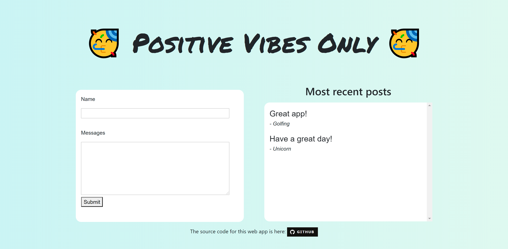

# Positive-Vibes-Only
This is an application that has a functional backend and database.
The frontend is deployed on [Netlify](https://positive-vibes-auckland.netlify.app/) and the backend is deployed on [Heroku](https://moodbook-backend.herokuapp.com/). The database is hosted on [MongoDb Atlas](https://www.mongodb.com/cloud/atlas).

## Motivation
At the conclusion of Create Camp 2020, I wanted to further develop my full stack development skills. So I decided to build a project based on a bootcamp that Summer of Tech hosted! I wanted to learn how to deploy to different websites, as well as deploying a working frontend and backend, as well as a database. 

## Plans
This is still a work in progress. As of (20/08/2020), I have the basic MVP done, as well as implemented a sentiment analysis program that determines if the text is positive or not. I am planning on implementing more features such as NER (Named-Entity Recognition) in the coming weeks! 

## Installation
Installation guides for each folder is in their respective README's. 

## Photo of the website:
